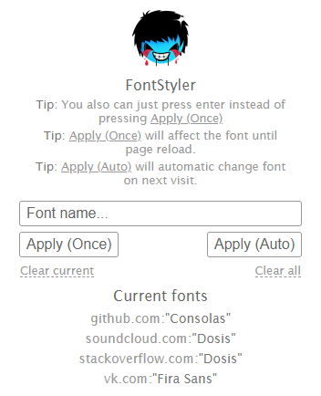

# FontStyler

Google Chrome extension, which allows you change the font on almost each site.



## Building from source

**NOTE:** You can just download the latest release from [GitHub](https://github.com/WisserTg/fontstyler-extension/releases)

**NOTE:** Also you can use raw version, but do not forget to change paths in `manifest.json`

* Install `node.js`

* Install depedencies

```sh
$ npm install
```

* Build extension

```sh
$ gulp default # or just `$ gulp`
```

## Installing in Chrome

* Open extensions page in Chrome browser


* Enable **developer** mode in upper right corner


* Click **Load unpacked** and specify the path to the root of build directory


## P.S.

Sorry for bad english :P